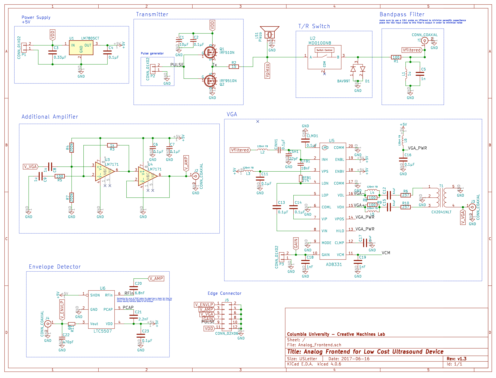

# Analog Frontend PCB
This folder contains the design files for the analog circuitry required for a single channel of an ultrasound imaging system. 

Schematic:
  
See the `drawings` folder for a high-resolution PDF version.

PCB:
  
See the `drawings` folder for a 1:1 scale PDF version, including each layer individually. 

### Changelog
* `v1.0` Initial design
* `v1.1` 
* `v1.2` 
* `v1.3` Added a row of header pins and silkscreened labels
* `v1.3-doc` Added documentation

Each version can be accessed in this repository through the git tag system. 

### Credits
The VGA subcircuit design was adapted from the [AD8331 evaluation board](http://www.analog.com/media/en/technical-documentation/evaluation-documentation/154207235AD8331EB_a.pdf). 

Community-developed KiCAD symbols and models:

* [SMA footprint](https://github.com/rascalmicro/rascalmicro-kicad-footprints.pretty/blob/master/SMA.kicad_mod)
* [SOT-523 footprint](https://github.com/cpavlina/kicad-pcblib/blob/master/smd-semi.pretty/SOT-523.kicad_mod)
* [Teensy symbols](https://github.com/XenGi/teensy_library) and [Teensy footprints](https://github.com/XenGi/teensy.pretty)

